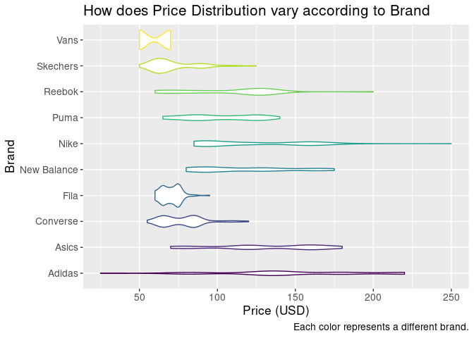

<!-- README.md is generated from README.Rmd. Please edit that file -->

# shoelati

\#insert my hex sticker

<!-- badges: start -->
<!-- badges: end -->

shoelati uses data on shoes collected from a particular region (last
updated two months ago) to understand the relationships between the
variables in the data and how they influence one another. This package
makes visualizations which are more accessible, conclusive, and fun.
Specifically, it uses package uses packages such as viridis to make the
visualizations more accessible for all individuals, including those who
suffer from colorblindness. It also performs commmon summary functions
to find trends in numeric variables after grouping or filtering by
numeric or categorical variables. Finally, it demonstrates how we can
use geoms such as emojis to make more fun graphs, while also uncovering
how general shoe types can cluster in particular variables.

## Installation

You can install the development version of shoelati from
[GitHub](https://github.com/) with:

``` r
# install.packages("devtools")
devtools::install_github("harvard-stat108s23/shoelati")
```

\##Exploring the data Let’s first explore the different variables in the
data and their diverse range of inputs.

``` r
library(shoelati)
library(ggplot2)
library(dplyr)
#> 
#> Attaching package: 'dplyr'
#> The following objects are masked from 'package:stats':
#> 
#>     filter, lag
#> The following objects are masked from 'package:base':
#> 
#>     intersect, setdiff, setequal, union
```

``` r
summary(shoelati)
#>     brand              model               type              gender         
#>  Length:1006        Length:1006        Length:1006        Length:1006       
#>  Class :character   Class :character   Class :character   Class :character  
#>  Mode  :character   Mode  :character   Mode  :character   Mode  :character  
#>                                                                             
#>                                                                             
#>                                                                             
#>     size_us          color             material           price_usd    
#>  Min.   : 6.000   Length:1006        Length:1006        Min.   : 25.0  
#>  1st Qu.: 8.000   Class :character   Class :character   1st Qu.: 70.0  
#>  Median : 9.000   Mode  :character   Mode  :character   Median : 90.0  
#>  Mean   : 8.912                                         Mean   :101.3  
#>  3rd Qu.:10.000                                         3rd Qu.:130.0  
#>  Max.   :12.000                                         Max.   :250.0  
#>  general_type          emoji          
#>  Length:1006        Length:1006       
#>  Class :character   Class :character  
#>  Mode  :character   Mode  :character  
#>                                       
#>                                       
#> 
```

## Examples

We can wrangle the data using unique variables to perform summary
functions:

``` r
shoelati |>
  group_by(brand) |>
  summarize(mean = mean(price_usd),
            sd = sd(price_usd),
            median = median(price_usd),
            max = max(price_usd),
            min = min(price_usd),
            count = n())
#> # A tibble: 10 × 7
#>    brand        mean    sd median   max   min count
#>    <chr>       <dbl> <dbl>  <dbl> <dbl> <dbl> <int>
#>  1 Adidas      147.  47.8     140   220    25   100
#>  2 Asics       131.  34.0     120   180    70   100
#>  3 Converse     77.6 13.9      75   120    55   100
#>  4 Fila         69.9  6.49     70    95    60    99
#>  5 New Balance 117.  30.5     110   175    80   100
#>  6 Nike        123.  34.1     120   250    85   118
#>  7 Puma        101.  22.4     100   140    65   100
#>  8 Reebok      109.  31.0     120   200    60   100
#>  9 Skechers     71.0 14.7      65   125    50    89
#> 10 Vans         60    9.02     65    70    50   100
```

We can also create meaningful data vidualizations:

``` r
library(viridis)
#> Loading required package: viridisLite

ggplot(data = shoelati, mapping = aes(x = price_usd, y = brand, color = brand)) +
  geom_violin() +
  guides(color = "none") +
  scale_color_viridis(discrete = TRUE) +
  labs(title = "How does Price Distribution vary according to Brand",
       x = "Price (USD)",
       y = "Brand",
       caption = "Each color represents a different brand.") +
  theme(text = element_text(size = 15))
```



You’ll still need to render `README.Rmd` regularly, to keep `README.md`
up-to-date. `devtools::build_readme()` is handy for this. You could also
use GitHub Actions to re-render `README.Rmd` every time you push. An
example workflow can be found here:
<https://github.com/r-lib/actions/tree/v1/examples>.

In that case, don’t forget to commit and push the resulting figure
files, so they display on GitHub and CRAN.
